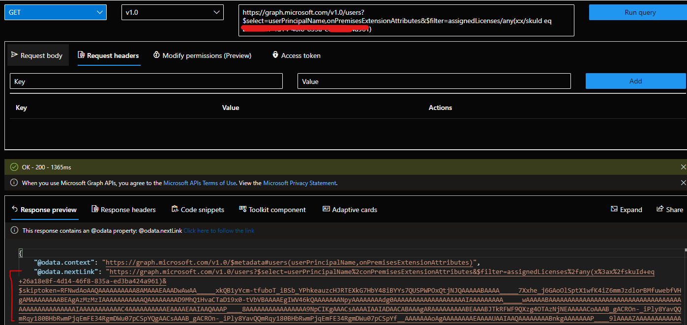
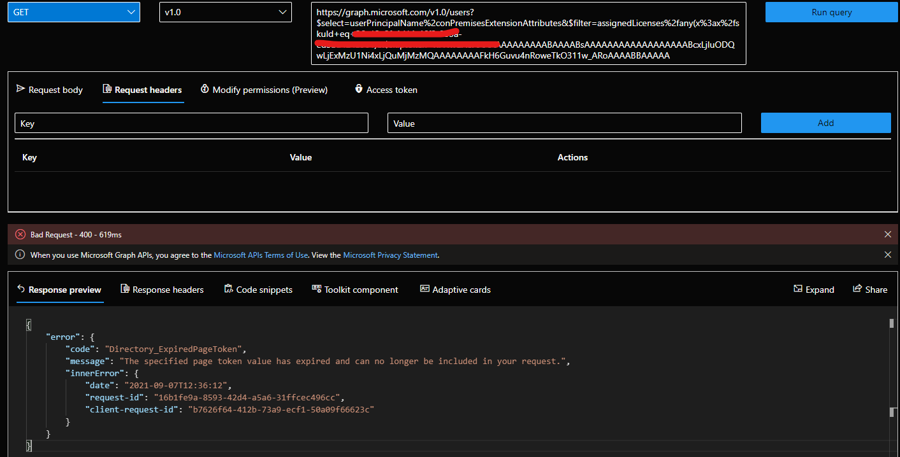
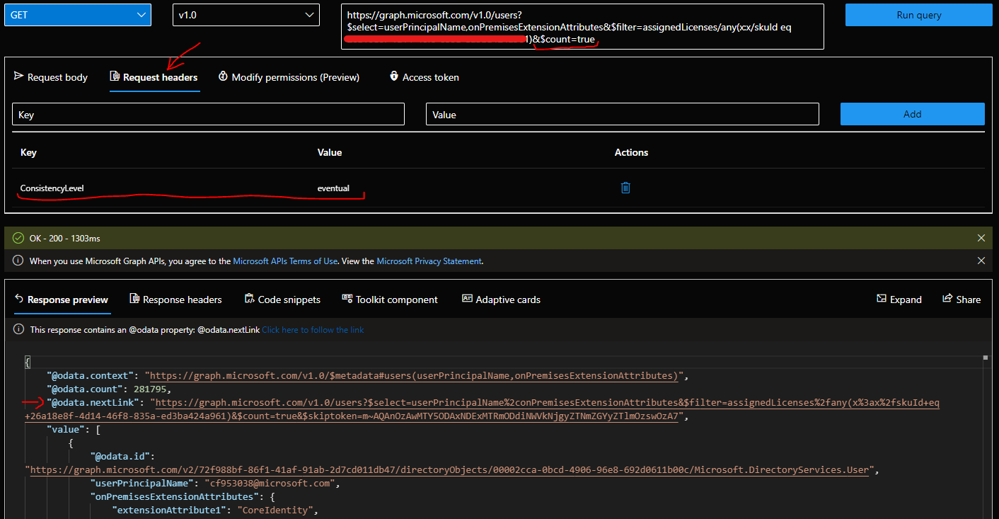
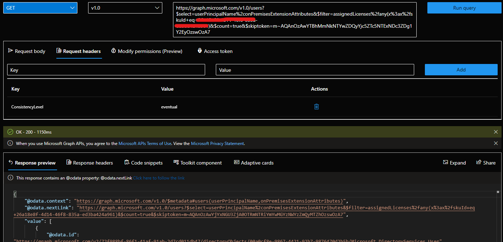
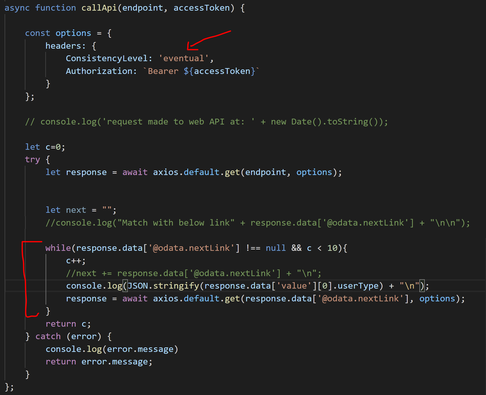
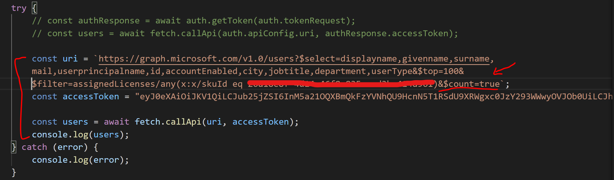
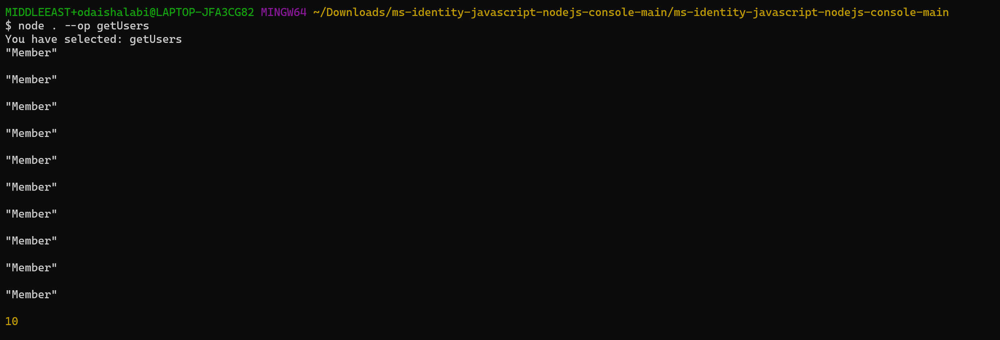
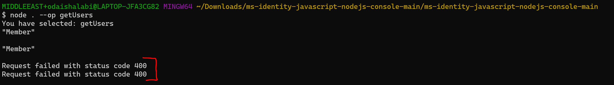
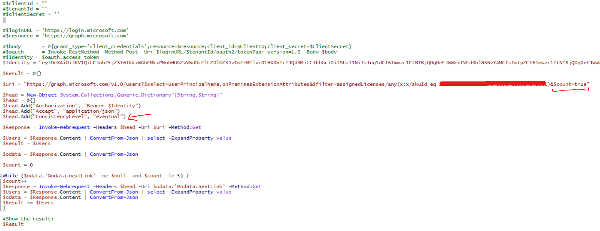
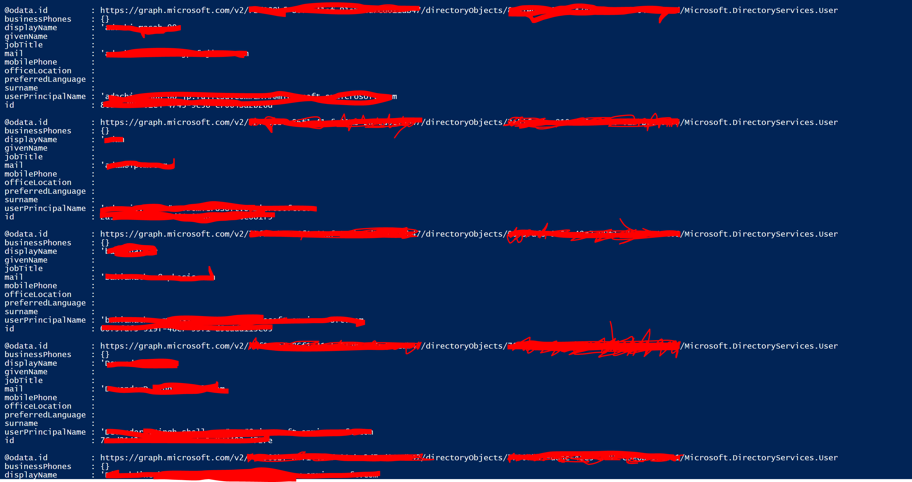

# Directory_ExpiredPageToken error when working with users API in Microsoft Graph

When fetching a large set of user data using graph API to get specific properties via `$filter` query parameter that returns [multiple pages](https://docs.microsoft.com/en-us/graph/paging?view=graph-rest-1.0) of data without using [advanced query capabilities](https://docs.microsoft.com/en-us/graph/aad-advanced-queries) a 400 bad request error code will be returned whenever requesting "@odata.nextLink" property to navigate to the next page.

```HTTP
GET https://graph.microsoft.com/v1.0/users?$select=userPrincipalName,onPremisesExtensionAttributes&$filter=assignedLicenses/any(a:a/skuId eq REPLACE_THIS)
```





Since the request is using `$filter` query parameter then [advanced query capabilities](https://docs.microsoft.com/en-us/graph/aad-advanced-queries)should be applied. The Microsoft Graph query engine uses an index store to fulfill query requests. To add support for additional query capabilities on some properties, these properties are now indexed in a separate store.

However, these advanced query capabilities are not available by default but, the requestor must also set the ConsistencyLevel header to eventual and, with the exception of $search, use the $count query parameter.

The ConsistencyLevel header and $count are referred to as advanced query parameters.

**Now we will showcase multiple examples on how to enable advanced query capabilities:**

## Graph Explorer



Now when requesting the `@odata.nextlink` will work as expected.



## NodeJS

We will use OAuth2 client credentials grant to call graph API and fetch `odata.nextlink`. Follow this tutorial to build this [sample console app](https://docs.microsoft.com/en-us/azure/active-directory/develop/tutorial-v2-nodejs-console).

For the sack of this demo,a small modification to the `callApi(endpoint, accessToken)` method inside the _`fetch.js`_ file to get the next page.



And small modification to the `fetch.callApi()` method inside the _`index.js`_ file where static values are used instead here.



The result is shown below. Please note that we're looping for 10 pages and only fetching `userType` due to console screen size:



Now if we removed the `ConsistencyLevel` header, the same error appears again.



## PowerShell



And the results were as follow:


